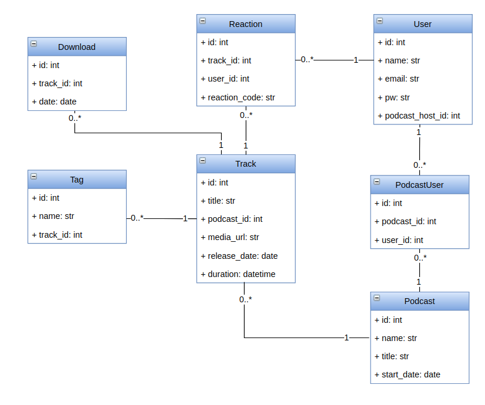

# podcaststore-django

This is a back-end API written in Python with Django and DRF to allow users to access a podcast store. In this podcast store, there are podcasts, tracks, users, tags, and users should be able to express a reaction to any track.

## API Docs

Based on [these requirements](./docs/api_requirements.md), these endpoints are available:

### Database UML diagram

Based on the [API and back-end requirements](./docs/api_requirements.md), the following UML relational diagram will be implemented:

